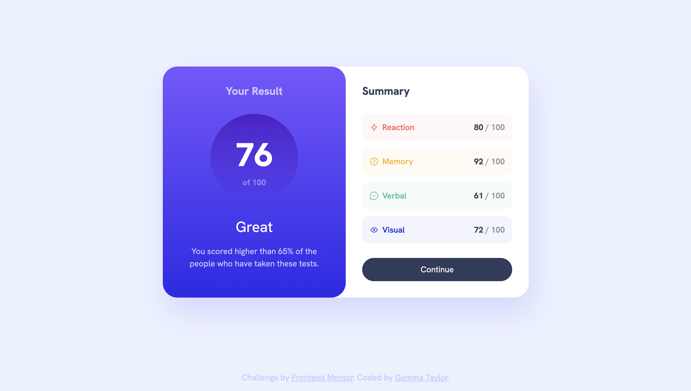
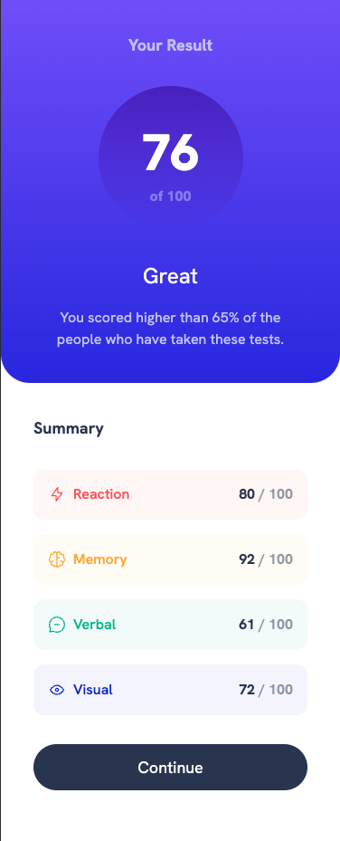

# Frontend Mentor - Results summary component solution

This is a solution to the [Results summary component challenge on Frontend Mentor](https://www.frontendmentor.io/challenges/results-summary-component-CE_K6s0maV). Frontend Mentor challenges help you improve your coding skills by building realistic projects. 

## Table of contents

- [Overview](#overview)
  - [The challenge](#the-challenge)
  - [Screenshot](#screenshot)
  - [Links](#links)
- [My process](#my-process)
  - [Built with](#built-with)
  - [What I learned](#what-i-learned)
  - [Continued development](#continued-development)
  - [Useful resources](#useful-resources)
- [Author](#author)

**Note: Delete this note and update the table of contents based on what sections you keep.**

## Overview

### The challenge

Users should be able to:

- View the optimal layout for the interface depending on their device's screen size
- See hover and focus states for all interactive elements on the page
- **Bonus**: Use the local JSON data to dynamically populate the content

### Screenshot




### Links

- Solution URL: [pending](pending)
- Live Site URL: [https://gemtay.github.io/results-summary-component/index.html](https://gemtay.github.io/results-summary-component/index.html)

## My process

### Built with

- Semantic HTML5 markup
- CSS custom properties
- Flexbox
- CSS Grid
- Mobile-first workflow

### What I learned

How to use the `calc()` function to increase the horizontal padding on the result section. This way I was able to define a variable `--padding` on the parent `summary-container` and make padding consistent across both sections, and use the calc function to increase just the inline padding slightly for the result section:
```css
.result {
  ...
  padding: var(--padding) calc(var(--padding) * 1.5);
  ...
}
```

Some HTML im proud of 🥰: creating a data attribute `data-spacing` to increase the data flow gap between some elements
```html
<div class="result grid-flow" data-spacing="large">
```
Some CSS im proud of: Defining the `--clr-category` on each `summary-item:nth-child(x)` and then setting the category background and text using that variable

```css
.summary-item {
    display: flex;
    justify-content: space-between;
    align-items: center;
    border-radius: 0.75rem;
    background-color: hsla(var(--category-clr), 0.05);
    padding: 1rem;
}

.summary-item--title {
    font-size: var(--fs-300);
    font-weight: var(--fw-medium);
    color: hsla(var(--category-clr), 1);
}

.summary-item:nth-child(1) {
    --category-clr: var(--clr-primary-red);
}
```

### Continued development

To go a step further, I would like to be able to also change the colour of the icons, for example, what if we want the "Visual" summary category to now have a purple icon, title and background instead of blue?

Solution:

I would embed the icon SVG's directly in the HTML, removed their colour eg `stroke="#FFB21E"`. Then set the stroke colour of the svg using the `--clr-category` in my CSS like so:
```css
.summary-item svg {
    stroke: hsl(var(--category-clr));
}
```
Now, if I define a new colour and set it as the Visual category colour:...

```css
:root {
  ...
  --clr-primary-purple: 276, 100%, 50%;
}

.summary-item:nth-child(4) {
    --category-clr: var(--clr-primary-purple);
}
```

...& tadaa!🎉


### Useful resources

- [MDN CSS docs](https://developer.mozilla.org/en-US/docs/Learn/CSS) - Always a useful source for checking CSS documentation. For this project I used it for checking how to create linear gradients, using the alpha value to create opacity with `hsla()`, grid columns and more...

## Author

- Website - [Gemma Taylor - Personal website pending 👀](#)
- Frontend Mentor - [@GemTay](https://www.frontendmentor.io/profile/GemTay)

